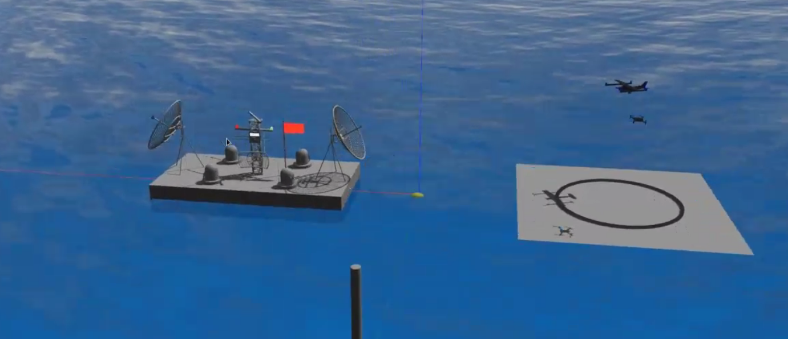

# 2020 IARC Simulation Challenge

### Problem Statement



<!-- ### Proposal

 -->

### Software Stack

The complete software stack is available on Github. It contains all the modules we have used:

- [https://github.com/AerialRobotics-IITK/IARC2020](https://github.com/AerialRobotics-IITK/IARC2020)

### General Overview of the modules used

The team was tasked to locate and secure a communication module that was held on a ship moving in a particular direction.  
Exact location was unknown, so the daughter UAV had to circle around the ship, locate a red banner behind the module, align to it with other visual aids, pick it with downward facing hooks whose control had to be fine tuned prior, and return to the mother craft.

- **Rosplane**: Decides the trajectory of the mother craft
- **Avoidance**: To avoid the rotating antenna above the communication module
- **Detection**: Detection of visual aids
- **Simulation_Tools**: Immitating real-world factors in a simulator. This includes the following
  - Wind: Effectively simulated on Gazebo itself, and corrected through waypoint based error estimation
  - Waves: a mesh simulated as waves, by controlling the height of the faces. Physics included by introducing buoyancy, which itself was calculated through mesh-mesh interactions
  - Gripper: Implemented a plugin for picking up the module
  - Magnets: Implemented its physics based on the fact that dipole moments are known prior
  - Other simulations included antenna, motors and the crafts themselves.
- **Simulation_Msgs**: Custom messages
- **Trajectory_Estimation**: Trajectory of the UAV, setting of waypoints
- **Rosflight**: Rosplane helper plugins
- **Mission_Nine**: Defines state machine design to handle mission states
