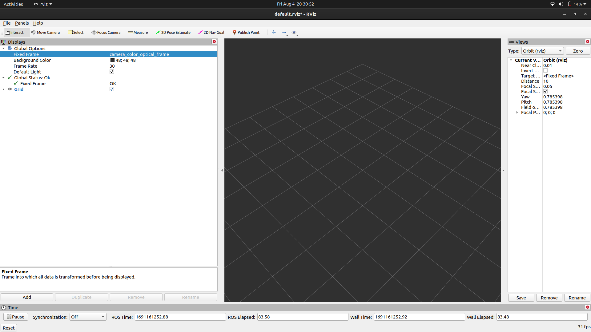
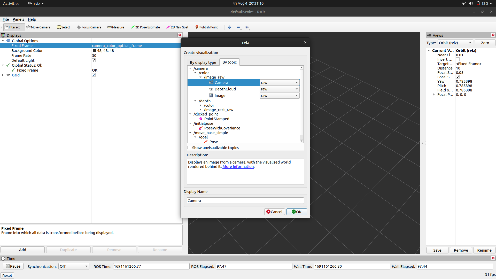
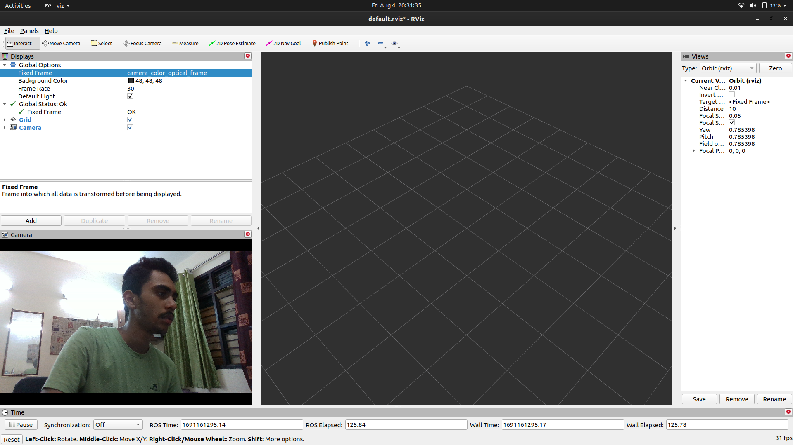
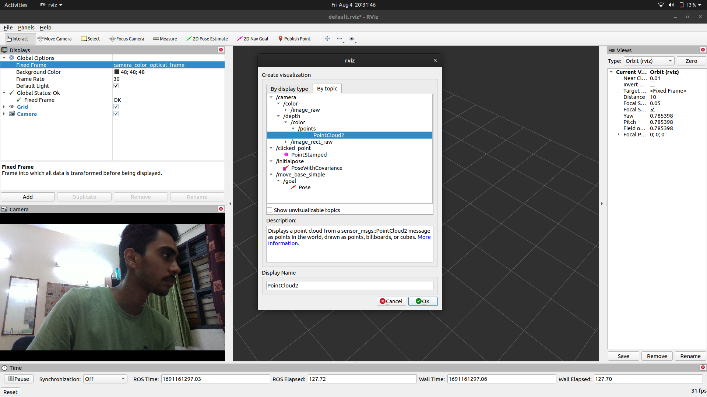
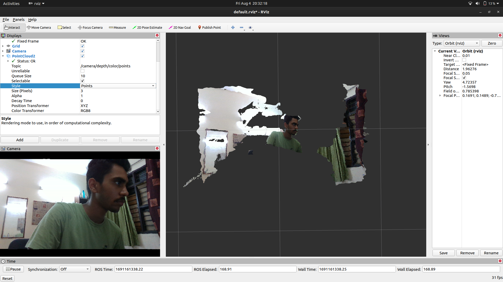
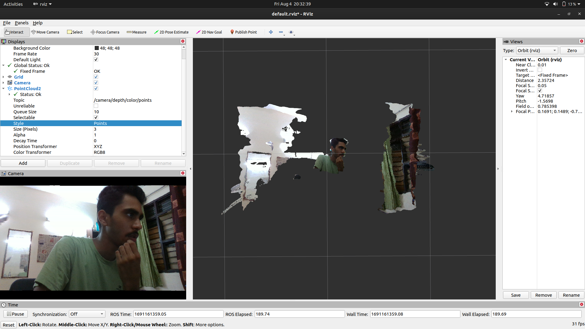

# Intel RealSense D435i setup for ROS Noetic

### Setting up ROS Package of Intel RealSense <a href="#setting-up-ros-package-of-intel-realsense" id="setting-up-ros-package-of-intel-realsense"></a>

```bash
sudo apt-get install ros-$ROS_DISTRO-realsense2-camera
sudo apt-get install ros-$ROS_DISTRO-realsense2-description
```

#### Note <a href="#note" id="note"></a>

We use _noetic_ ROS Distribution

### Make the Workspace for Intel RealSense ROS Package <a href="#make-the-workspace-for-intel-realsense-ros-package" id="make-the-workspace-for-intel-realsense-ros-package"></a>

```bash
mkdir -p ~/catkin_ws/src
cd ~/catkin_ws/src/
git clone https://github.com/IntelRealSense/realsense-ros.git
cd realsense-ros/
git checkout `git tag | sort -V | grep -P "^2.\d+\.\d+" | tail -1`
cd ..
```

### Building the Package <a href="#building-the-package" id="building-the-package"></a>

```bash
catkin_init_workspace
cd ..
catkin_make clean
catkin_make -DCATKIN_ENABLE_TESTING=False -DCMAKE_BUILD_TYPE=Release
catkin_make install
```

### Adding Source File to bashrc <a href="#adding-source-file-to-bashrc" id="adding-source-file-to-bashrc"></a>

```bash
echo "source ~/catkin_ws/devel/setup.bash" >> ~/.bashrc
source ~/.bashrc
```

### Running the Camera <a href="#running-the-camera" id="running-the-camera"></a>

Launch the **rs\_camera.launch** launch file located in **realsense2\_camera** package

```bash
roslaunch realsense2_camera rs_camera.launch filters:=pointcloud
```

Launch _rviz_ to Visualize the Camera Feed and Depth

```bash
rviz
```

In Fixed Frame, select _camera\_color\_optical\_frame_

<figure><figcaption></figcaption></figure>

Then Click _add_, goto _By topic_, expand _/camera_, _/color_ and _/image\_raw_, select _camera_ with _raw_ option and then click Ok.&#x20;

<figure><figcaption></figcaption></figure>

It would show the Camera Feed in the Bottom Left

<figure><figcaption></figcaption></figure>

Then Click _add_, goto _By topic_, expand _/camera_, _/depth_, _/color_ and _/points_, select _PointCloud2_ and then click Ok.

<figure><figcaption></figcaption></figure>

It would show the Depth with color.

<figure><figcaption></figcaption></figure>

Select _Points_ in the _Style_ Parameter to get a better Visualization


<figure><figcaption></figcaption></figure>
