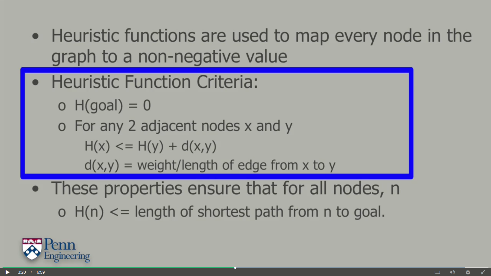

# A\* Algorithm

This algorithm uses the concept of a heuristic destination, which implies that the minimum distance is encountered in the direction of destination. Although, sometimes it might go wrong due to some obstacles encountered in between and we might need to head in the opposite direction.

Some common heuristic functions used are the Euclidean distance and the Manhattan distance. We proceed to the neighbouring node closest to the destination and then update the neighbors of the node.

For more detailed information refer:



