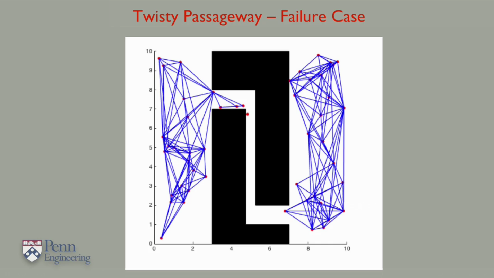

# Probabilistic Roadmap

An alternative idea for dealing with these situations is to choose points in the configuration space randomly instead of uniformly, in the hope that we will choose a set of configurations that capture the underlying structure of the free space. This illustrates the basic idea of this algorithm on a 2D configuration space. On every iteration, the system chooses a configuration in the configuration space at random, and tests whether it is in free space using the collision check function.

If it is in free space, it then tries to see if it can forge routes between this new configuration and the closest existing samples in the graph. Every path that it creates is recorded as a new edge in the graph that the system is building.

In these figures, the solid green lines correspond to new links that are added, while the dashed green line represents a connection that failed due to collision with the obstacle.

### Problem with this algorithm

A complete path planning algorithm would find a path if one existed, and report failure if it didn't. With this procedure, it is possible to have a situation where the algorithm would fail to find a path even when one exists, i.e. if the sampling procedure fails to generate an appropriate set of samples. For example, the situation shown in this figure where there is a path but it involves finding a route through this small passageway. In order to find this route, a sampling algorithm would have to randomly generate samples in that narrow area.

For more info on this algorithm, read:


