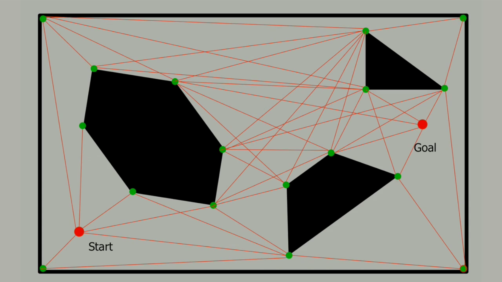
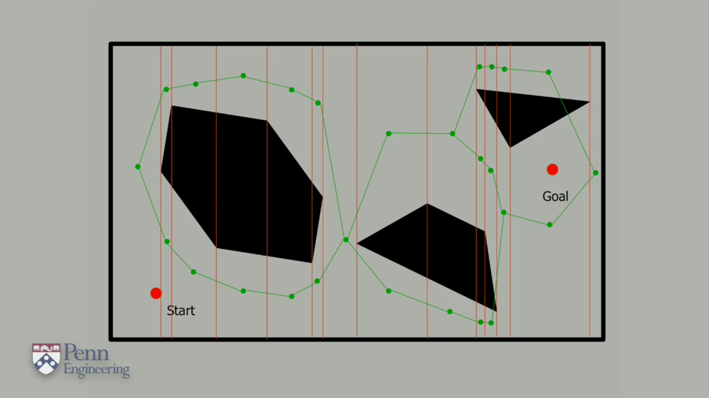

# Visibility Graph Analysis

This algorithm basically involves drawing an edge between any two vertices that can be connected by a straight line that lies entirely in free space. This visibility graph algorithm is actually complete. That is, it will find a path if one exists and report failure if no path can be constructed. This could happen if the start position or end position was entirely surrounded by an obstacle. Moreover, you can also prove that this algorithm actually constructs the shortest possible path between the two points.

The nice thing about this is that these shapes are convex, which means that the robot can safely move in a straight line between any two points in each of the cells. As we said earlier we can form a graph where the nodes are these trapezoidal regions of free space and the edges indicate which of these regions are adjacent to each other. 

Path planning is then carried out by finding out which cell contains the start location and which the goal and then planning a path through the graph between these two nodes.

For detailed information click below:



