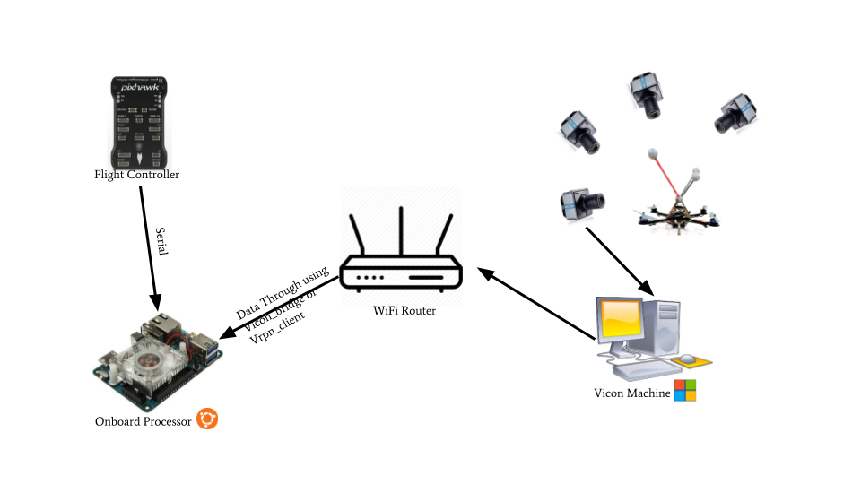

# Setup with VICON

## Initial setup of VICON

* **Camera and data stream setup:**





* Creating Object in [VICON Tracker](https://www.vicon.com/products/software/tracker)
  * First align Robot's front with global frame's x-axis then create object.


Alignment is compulsory to avoid problem with velocity and orientation of robot.


## Getting pose data on Onboard Processor

* Using [ROS](http://wiki.ros.org/kinetic/Installation/Ubuntu), get data from the VICON Machine
  * According to your processor you can use the following methodsL



* Processors like [Intel NUC ](https://www.intel.in/content/www/in/en/products/boards-kits/nuc.html)
  * Install the `vicon_bridge` package from





* Processors like[ Odroid XU4](https://wiki.odroid.com/odroid-xu4/odroid-xu4), [Raspberry Pi](https://www.raspberrypi.org/)

  * Install the `vrpn_client_ros` using

  ```bash
  sudo apt-get install ros-kinetic-vrpn-client-ros -y
  ```





## Odometry from Pose data




