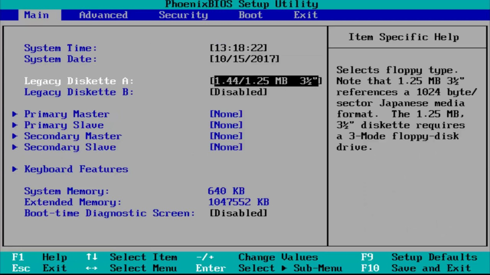

# Installing Ubuntu

> You will install Ubuntu 18.04 through the following instructions. Ubuntu 20.04 LTS should be extremely similar to setup.

## Step 1: Download the .iso file

> The latest stable version of Ubuntu that can support all the software we use is 18.04.

Download the required Ubuntu disk image file from here:




Choose the Desktop image.  
The file is named **ubuntu-18.04.6-desktop-amd64.iso**.


## Step 2: Unallocate Space

Ubuntu 18.04 requires ~8 Gb for complete disk installation, but you need to have more utilities.  
A space of 100 Gbs usually suffices, but that's your choice.  
Refer here:



## Step 3: Create a bootable USB drive

Download and run Rufus, a startup disk creator:



Install Rufus, and upon starting the application should look like:  

Insert the external flash drive, Rufus would automatically detect it as _Device_  
Under _Boot Selection_ choose the ISO file downloaded above.  
Leave _Partition Scheme_ and _Target System_ as defaults.  
Start the process.

## Step 4a: Reboot

Reboot the system, keeping the startup disk connected, and Enter BIOS Menu.  
Reboot your system, and while it turns on, before your laptop's brand's icon shows up. Repeatedly press the key (Keys to be pressed vary a lot, usually it is `F2`, confirm from ) until the BIOS Menu shows up, something like this:  

## Step 4b: Configuring BIOS

Windows Supremacy till yet, time to change things.
Turn off UEFI Secure Boot and Legacy Boot (if available) settings.  
Now in the _Boot Device Select Menu_ change the Boot Order to USB first.  
More info here:



Save changes and Exit BIOS.

## Step 5a: Install Ubuntu

Once you boot the system from USB, Ubuntu Installation wizard will greet you.  
Rest steps should be kept as default unless you know what you're doing.  
The steps where you have to take care are:

- Tick the _Install third party softwares for graphics and Wifi hardware [...]_
- Under Installation Type Menu, choose _Something Else_ and under that, use the unallocated partitions you created in Step 2, more info regarding this is below.

### Step 5b: Allocating Spaces

Distribute the unallocated space to 3 partitions, `root`, `home` and `swap`(recommended, if low RAM device)  
To create the first partition, the root partition, select the free space (the shrinking space from Windows created earlier), and hit on the + icon below. On partition settings use the following configurations and hit OK to apply changes:

- Size = at least 15000 MB
- Type for the new partition = Primary
- Location for the new partition = Beginning
- Use as = EXT4 journaling file system
- Mount point = /


It is recommended to place root partition onto primary partition on MBR scheme disks


Create the swap partition using the same steps as above.

- Size = 512 MB to 4 GB
- Type for new partition = Primary
- Location for the new partition = Beginning of this space
- Use as = swap area

Create the home partition using similar steps. Use all the available free space left for the home partition size. The partition settings should look like this:

- Size = all remaining free space
- Type for the new partition = Primary
- Location for the new partition = Beginning
- Use as = EXT4 journaling file system
- Mount point = /home

(OPTIONAL)

> You can allocate more partitions for `/boot`, `/tmp` and `/var`.  
> To understand what they are, refer [here](https://www.javatpoint.com/linux-file-system) (in short, they are files/directories, you're allocating explicit space for them)

Press _Install Now_ after verifying that you're good to go.

### Step 6: Confirm installation and move ahead

You should now be left with customisations of Ubuntu.  
Well Done and welcome to the Open world!


More detailed Installation guide [here](https://phoenixnap.com/kb/how-to-install-ubuntu-18-04) and [here](https://www.tecmint.com/install-ubuntu-alongside-with-windows-dual-boot/)

